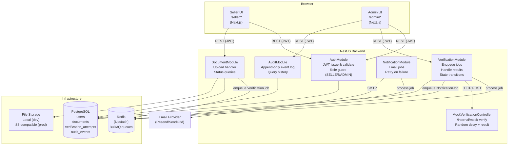

# DESIGN.md — Document Verification Workflow

> KVY Tech Take-Home | Author: Tran Xuan Quang | Stack: NestJS · Next.js · PostgreSQL · BullMQ

---

## 1. Problem Framing

### What is the real problem?

On the surface, this feature uploads and checks a document. The real problem is **trust bootstrapping at the point of seller onboarding**.

A marketplace's integrity depends on who it lets in. A seller with a fraudulent business license can list non-existent products, collect payments, and disappear — harming buyers, generating chargebacks, and eroding platform reputation. The document verification workflow is the **trust gate**: it blocks sellers from transacting until their identity claim is independently confirmed.

The tension the platform must manage is:

- **Too slow or opaque** → legitimate sellers churn during onboarding, go to a competitor
- **Too permissive or automated** → fraud slips through, platform liability increases
- **Poor audit trail** → compliance failures, no accountability when things go wrong

This feature must solve all three simultaneously: fast enough for good sellers, rigorous enough to catch bad actors, and auditable enough to satisfy internal and external scrutiny.

### Stakeholders and Success Criteria

| Stakeholder  | What they need                                                                                             | Success looks like                                                                                            |
| ------------ | ---------------------------------------------------------------------------------------------------------- | ------------------------------------------------------------------------------------------------------------- |
| **Seller**   | Know exactly where they are in the process; no black box; clear next action if rejected                    | Upload → receive final decision ≤ 24h; rejection includes an actionable reason; no silent failures            |
| **Admin**    | See what needs their attention; have enough context to make a confident decision quickly                   | Pending queue is clear; each item shows document + automated verdict + upload timestamp; no duplicate reviews |
| **Platform** | Prevent fraudulent onboarding; maintain full audit trail; system handles load spikes without dropping jobs | Every state transition is logged; external service failures degrade gracefully; no jobs are silently lost     |

### Explicitly Out of Scope

- **Seller re-upload / appeal flow** — what happens after rejection is a separate product decision
- **Multiple document types** — only one document per seller, one type (business license / tax registration)
- **OCR, AI-based document analysis** — the mock service is the only automated check
- **Real-time push notifications** — seller refreshes to see status (WebSocket/SSE is a descoped item)
- **Document expiry / re-verification** — verified documents are assumed valid indefinitely for this scope
- **Admin workload balancing / assignment** — any admin can review any pending document
- **Billing, subscription, or marketplace listing** — this workflow only gates seller activation

---

## 2. Clarifying Questions

Listed in priority order. Higher priority = answer changes more of the design.

### Q1 — Does the external verification service use webhook callbacks or must we poll?

**Why it matters:** This is the most fundamental architectural question. If the service pushes a callback to us, the `VerificationProcessor` becomes a receiver that updates state on receipt. If we must poll, we need a retry/backoff loop managed by BullMQ. The entire async processing design branches on this answer.

**Working assumption:** The external service has no webhook support. We poll by re-enqueueing a delayed BullMQ job after each inconclusive check, with exponential backoff. After a maximum number of attempts (configurable), we escalate to `INCONCLUSIVE` for admin review rather than retrying indefinitely.

---

### Q2 — What is the expected SLA for a final verification decision? What is acceptable latency for the seller?

**Why it matters:** Drives retry strategy, timeout values, and escalation logic. If sellers expect results in 5 minutes, we need aggressive polling. If 24 hours is acceptable, we can afford longer backoff intervals and a daily admin review cadence.

**Working assumption:** Sellers expect a final outcome within 24 hours. Automated decisions (verified/rejected) should arrive within minutes under normal conditions. Inconclusive cases entering admin review must be resolved within 24 hours of escalation.

---

### Q3 — Can a seller upload a new document if their current one is rejected or still under review?

**Why it matters:** Determines whether `REJECTED` and `APPROVED` are truly terminal states or entry points back into the workflow. If re-upload is allowed, the data model needs to support multiple document versions per seller and define which one is "active."

**Working assumption:** No re-upload flow in this scope. `APPROVED` and `REJECTED` are terminal states. If re-upload is needed, it is a separate feature built on top of this one.

---

### Q4 — What channels are available for seller notifications? (Email? In-app? SMS? Webhook?)

**Why it matters:** Determines the `NotificationModule` integration surface. Email requires an SMTP/transactional email provider. In-app notifications require a persistent notification store and UI. SMS adds a third-party provider dependency.

**Working assumption:** Email only. We integrate with a transactional email provider (e.g., SendGrid, Resend) via a BullMQ `NotificationJob`. In-app notifications are descoped.

---

### Q5 — What are the file constraints? (Max size, accepted MIME types, malware scanning?)

**Why it matters:** Drives upload infrastructure decisions. Large files (50MB PDFs) need streaming uploads and server-side size limits. Malware scanning requires a third-party service or in-process library. Unsupported formats need clear rejection messages.

**Working assumption:** Max file size 10MB. Accepted types: PDF, JPEG, PNG. No malware scanning in this scope (descoped item — real risk noted in Section 7).

---

### Q6 — Is this a multi-admin environment? How should concurrent review of the same document be handled?

**Why it matters:** If two admins can simultaneously view and submit a review for the same inconclusive document, we get a race condition: both reads succeed, both writes attempt to move the document to a terminal state. One will silently overwrite the other.

**Working assumption:** Multiple admins exist. We handle concurrent review with **optimistic locking** — a `version` integer column on `documents`. A review attempt includes the current version; if it has changed by the time the update runs, we return `409 Conflict` with a clear message ("This document was already reviewed by another admin").

---

### Q7 — What does the audit log need to satisfy? (Internal analytics? GDPR compliance? SOC 2?)

**Why it matters:** GDPR requires the ability to delete or anonymize personal data, which conflicts with an immutable audit log. SOC 2 requires evidence of access control and change history. These are incompatible in naive implementations.

**Working assumption:** Audit log is for internal operational visibility only (no specific compliance framework in this scope). Log is append-only but not cryptographically immutable. PII in audit entries can be anonymized separately if GDPR becomes a requirement.

---

### Q8 — Does the external verification service have rate limits or a per-request cost?

**Why it matters:** If the service charges per call or caps requests per minute, we need a throttle on the BullMQ processor. Unbounded retries on a paid API can produce unexpected costs.

**Working assumption:** No rate limit constraints for this demo. In production, we'd configure BullMQ `limiter` options on the queue.

---

### Q9 — Should inconclusive documents expire if no admin reviews them within a time window?

**Why it matters:** Without escalation or expiry, documents can sit in `PENDING_REVIEW` indefinitely. The seller is blocked; the admin queue grows silently.

**Working assumption:** No automatic expiry in this scope. We surface "time in queue" prominently in the admin UI to encourage timely review. A configurable SLA reminder (cron job) is descoped but noted.

---

### Q10 — Is there a concept of "document history" — i.e., can admins see previous verification attempts for a seller?

**Why it matters:** Determines whether `verification_attempts` needs to be a separate table (supporting many attempts per document) or if documents are 1-to-1 with attempts.

**Working assumption:** Yes — admins should see all attempts for a document (e.g., external service was called three times before escalating to inconclusive). We use a separate `verification_attempts` table for this.

---

## 3. Architecture

### Component Diagram



### Component Breakdown

| Component                      | Responsibility                                                                                  | Why it exists separately                                                                                                                                                |
| ------------------------------ | ----------------------------------------------------------------------------------------------- | ----------------------------------------------------------------------------------------------------------------------------------------------------------------------- |
| **AuthModule**                 | JWT issuance, validation, role-based guards                                                     | Cross-cutting concern; isolating it means every other module just applies `@Roles()` decorator without owning auth logic                                                |
| **DocumentModule**             | Accept file upload, persist metadata, serve download URL, expose status to seller               | Owns the document lifecycle at the data layer; separating from VerificationModule means upload concerns (file size, MIME type, storage) don't bleed into business logic |
| **VerificationModule**         | Enqueue verification jobs, call mock service, apply state transitions, escalate to admin review | Core business logic; owns the state machine. Separated because it has async behavior and external I/O that needs its own error handling                                 |
| **NotificationModule**         | Send email notifications to sellers on final outcomes                                           | Separated so notification failures never affect verification state. Retries independently                                                                               |
| **AuditModule**                | Append audit events on every significant action; expose history to admin                        | Separated to enforce append-only access pattern. No other module deletes or updates audit records                                                                       |
| **MockVerificationController** | Simulate the external service with configurable delay and weighted random outcomes              | Isolated endpoint to make it easy to test different scenarios (change weights in config, not in processor)                                                              |

### Data Model

```sql
-- Users (both sellers and admins)
users
  id          UUID PRIMARY KEY DEFAULT gen_random_uuid()
  email       VARCHAR(255) UNIQUE NOT NULL
  password    VARCHAR(255) NOT NULL          -- bcrypt hash
  role        VARCHAR(20) NOT NULL           -- 'SELLER' | 'ADMIN'
  created_at  TIMESTAMPTZ DEFAULT NOW()

-- One document per seller (enforced by unique index)
documents
  id              UUID PRIMARY KEY DEFAULT gen_random_uuid()
  seller_id       UUID NOT NULL REFERENCES users(id)
  file_path       VARCHAR(500) NOT NULL      -- storage path/key
  file_name       VARCHAR(255) NOT NULL      -- original filename
  file_size       INTEGER NOT NULL           -- bytes
  mime_type       VARCHAR(100) NOT NULL
  status          VARCHAR(30) NOT NULL       -- see state machine
  rejection_reason VARCHAR(500)             -- populated on REJECTED
  version         INTEGER NOT NULL DEFAULT 0 -- optimistic locking
  uploaded_at     TIMESTAMPTZ DEFAULT NOW()
  updated_at      TIMESTAMPTZ DEFAULT NOW()

  CONSTRAINT uq_seller_active_doc UNIQUE (seller_id)
  CONSTRAINT chk_status CHECK (status IN (
    'PENDING_VERIFICATION', 'VERIFIED', 'REJECTED',
    'INCONCLUSIVE', 'PENDING_REVIEW', 'APPROVED'
  ))

-- Each call to external service
verification_attempts
  id              UUID PRIMARY KEY DEFAULT gen_random_uuid()
  document_id     UUID NOT NULL REFERENCES documents(id)
  attempt_number  INTEGER NOT NULL
  raw_result      VARCHAR(30)                -- 'verified' | 'rejected' | 'inconclusive' | null
  raw_response    JSONB                      -- full response payload for debugging
  error_message   TEXT                       -- if service was unreachable
  duration_ms     INTEGER                    -- response time
  attempted_at    TIMESTAMPTZ DEFAULT NOW()

-- Append-only audit trail
audit_events
  id          UUID PRIMARY KEY DEFAULT gen_random_uuid()
  document_id UUID NOT NULL REFERENCES documents(id)
  actor_id    UUID REFERENCES users(id)      -- null for system actions
  actor_role  VARCHAR(20)                    -- 'SELLER' | 'ADMIN' | 'SYSTEM'
  action      VARCHAR(60) NOT NULL           -- e.g. 'DOCUMENT_UPLOADED', 'ADMIN_APPROVED'
  from_status VARCHAR(30)
  to_status   VARCHAR(30)
  metadata    JSONB                          -- additional context (rejection reason, attempt #, etc.)
  created_at  TIMESTAMPTZ DEFAULT NOW()
```

### State Machine

```
                        ┌─────────────────────────────────┐
                        │         PENDING_VERIFICATION     │
                        │  (initial state on upload)       │
                        └──────────────┬──────────────────┘
                                       │ BullMQ VerificationJob runs
                                       │ → calls mock service
                                       │
               ┌───────────────────────┼────────────────────────┐
               │                       │                        │
               ▼                       ▼                        ▼
        ┌─────────────┐        ┌──────────────┐        ┌──────────────────┐
        │  VERIFIED   │        │   REJECTED   │        │   INCONCLUSIVE   │
        │             │        │              │        │  (max retries OR │
        └──────┬──────┘        └──────┬───────┘        │   service said   │
               │                      │                │   inconclusive)  │
               │ System enqueues       │ System enqueues └────────┬─────────┘
               │ NotificationJob       │ NotificationJob          │
               │                       │                          │ Admin takes action
               ▼                       ▼                          ▼ via POST /admin/review
        ┌─────────────┐        ┌──────────────┐        ┌──────────────────┐
        │  APPROVED   │        │   REJECTED   │        │  PENDING_REVIEW  │
        │  (terminal) │        │  (terminal)  │        │                  │
        └─────────────┘        └──────────────┘        └──┬───────────────┘
                                                          │         │
                                             ┌────────────┘         └────────────┐
                                             ▼                                   ▼
                                      ┌─────────────┐                   ┌──────────────┐
                                      │  APPROVED   │                   │   REJECTED   │
                                      │  (terminal) │                   │  (terminal)  │
                                      └─────────────┘                   └──────────────┘

Transition guards:
  PENDING_VERIFICATION → VERIFIED/REJECTED/INCONCLUSIVE : only SYSTEM (VerificationProcessor)
  INCONCLUSIVE → PENDING_REVIEW                         : only SYSTEM (after max retries or service inconclusive)
  PENDING_REVIEW → APPROVED/REJECTED                    : only ADMIN role
  Any → APPROVED/REJECTED (terminal)                    : triggers NotificationJob enqueue
```

---

## 4. Stack Decisions

### Backend — NestJS

**Chosen:** NestJS with TypeScript

**Why:** NestJS's module system maps directly onto domain boundaries (AuthModule, DocumentModule, etc.). `@nestjs/bull` provides first-class BullMQ integration with decorators. Dependency injection makes unit testing straightforward — processors and services can be instantiated with mocked dependencies without a running server. Built-in `ValidationPipe` with `class-validator` handles input validation with minimal boilerplate.

**Alternative rejected:** Express — viable but requires manually assembling what NestJS provides: dependency injection, module structure, validation, error handling. Given a 5-day timeline, the productivity cost is not justified when NestJS's patterns produce a more defensible architecture interview-wise.

---

### Frontend — Next.js (App Router)

**Chosen:** Next.js 14 with App Router

**Why:** Role-based routing maps naturally onto route groups (`/(seller)/` and `/(admin)/`). Middleware can enforce role checks before pages render. Vercel deployment is a single `git push`. Server Components reduce client-side bundle size for the admin list views.

**Alternative rejected:** Separate React SPAs for seller and admin — doubles the deployment surface area and doesn't provide meaningful isolation benefit for this scope. A single Next.js app with route-based role guarding is simpler.

---

### Database — PostgreSQL

**Chosen:** PostgreSQL (via Supabase or Railway)

**Why:** The state machine requires ACID transactions — when we transition a document's status and write an audit event, both must succeed or neither does. PostgreSQL's `CHECK` constraints serve as a safety net enforcing valid state values at the DB level, independent of application logic. JSONB columns for audit metadata and raw verification responses avoid premature schema rigidity while keeping data queryable.

**Alternative rejected:** SQLite — no concurrent write safety for admin reviews. MySQL — viable, but PostgreSQL's JSONB and better TypeORM support makes it preferable.

---

### Async Processing — BullMQ + Redis (Upstash)

**Chosen:** BullMQ with Upstash Redis

**Why:** Jobs survive server restarts (persisted in Redis). Built-in retry with exponential backoff. Job state visibility (waiting, active, completed, failed) aids debugging. `@nestjs/bull` provides `@Processor()` and `@Process()` decorators that keep async logic co-located with the domain module. Upstash's serverless Redis works on Render/Railway free tiers without a persistent connection requirement.

**Alternative considered — pg-boss:** Uses PostgreSQL as the queue backend — eliminates the Redis dependency entirely. Simpler infrastructure for this project size. I chose BullMQ because it's in the JD context I'm optimizing for, but **pg-boss is a legitimate and arguably simpler choice** for this specific project and worth noting as the "what I'd change" answer.

**Alternative rejected — setTimeout / setInterval:** Not persistent. A server restart drops all pending jobs silently. Completely unsuitable for a workflow where a document can be in flight for hours.

---

### File Storage — Local (dev) / S3-compatible (prod)

**Chosen:** Multer for upload handling; local filesystem in development; S3-compatible bucket (Cloudflare R2 free tier or Supabase Storage) in production

**Why:** Documents are binary blobs that don't belong in a relational database. Serving them from the database adds read pressure on the primary. Separating storage means the file access pattern (large sequential reads) doesn't compete with the transactional query pattern.

**Alternative rejected:** Storing files as PostgreSQL `bytea` — works but creates bloated backups, adds load to the primary, and makes it harder to add CDN or signed URL patterns later.

---

## 5. Trade-offs and Decisions

### Decision 1 — Polling vs. Webhook for external service

**Decision:** Poll via BullMQ delayed retry jobs.

**Alternatives:**

- _Webhook:_ External service POSTs result to our callback URL. Zero polling overhead, instant notification.
- _Long polling:_ Keep HTTP connection open until service responds. Simple but ties up a server thread per in-flight document.

**Why polling:** The mock service doesn't support webhooks. Polling with BullMQ gives us retry, backoff, and job persistence for free. In a production integration, I'd surface this as Clarifying Question 1 and design for webhook-first.

**What I'd change:** If the external service supports webhooks, I'd expose a `POST /internal/verification-callback` endpoint, validate the payload signature (HMAC), and drive state transitions from there. BullMQ would only be used for notifications and admin-review reminders.

---

### Decision 2 — State machine enforcement: application vs. database layer

**Decision:** Enforce state transitions in the NestJS service layer (explicit `if currentStatus !== expected throw` checks), with PostgreSQL `CHECK` constraints as a safety net.

**Alternatives:**

- _Pure DB triggers:_ State machine logic in PL/pgSQL. Enforced at write time regardless of which application code calls the DB.
- _Event sourcing:_ No mutable `status` column; derive current state from the event log.

**Why application layer:** Business logic is readable and testable in TypeScript. DB triggers are hard to test, hard to version-control meaningfully, and produce cryptic errors that bubble up to clients. Event sourcing is appropriate for complex audit/replay requirements — it's over-engineered for this scope but worth noting as the "what if compliance requirements escalate" answer.

**What I'd change:** If the platform needed GDPR-compliant event replay or regulatory audit requirements, I'd move toward event sourcing with the `audit_events` table becoming the source of truth and `documents.status` becoming a materialized projection.

---

### Decision 3 — Audit log structure

**Decision:** Append-only `audit_events` table with a `metadata JSONB` column. No updates or deletes.

**Alternatives:**

- _Column-level history with `temporal_tables`:_ Automatically track every column change. More granular but harder to query for business events.
- _Application-level event log in a separate service:_ Decoupled but over-engineered for this scope.

**Why append-only table:** Simple to implement, query, and reason about. Every business event (upload, verification attempt, admin decision, notification sent) gets one row. The JSONB `metadata` column captures context without requiring a schema change per event type. Administrators see a clean chronological narrative.

**What I'd change:** For higher compliance requirements, add a cryptographic hash chain (each event includes a hash of the previous event) to make tampering detectable.

---

### Decision 4 — Concurrent admin review (optimistic locking)

**Decision:** Optimistic locking via a `version` integer column on `documents`. Admin review endpoint performs: `UPDATE documents SET status=$1, version=version+1 WHERE id=$2 AND version=$3`. If 0 rows updated → return `409 Conflict`.

**Alternatives:**

- _Pessimistic locking (`SELECT FOR UPDATE`):_ Lock the row when admin opens the review page. Safe but holds a lock for the duration of human review time (potentially minutes), blocking other DB reads on that row.
- _Document assignment:_ When admin opens a document, "claim" it (set `assigned_admin_id`). Other admins see it as taken. Eliminates conflict but requires an unclaim mechanism (TTL + background job).

**Why optimistic locking:** Admin-to-document conflicts are rare. Optimistic locking imposes zero overhead in the common case and produces a clear, user-actionable error in the rare conflict case. Pessimistic locking's long-held locks are inappropriate for human-paced workflows.

**What I'd change:** If admin team grows and queue contention becomes frequent, add a lightweight "claim" mechanism with a 10-minute TTL — giving each admin an exclusive window while not blocking the queue indefinitely if they abandon the review.

---

### Decision 5 — Notification delivery

**Decision:** Notifications are a separate BullMQ `NotificationJob` enqueued by the `VerificationModule` after a terminal state is reached. `NotificationModule` processes these independently.

**Alternatives:**

- _Inline notification in VerificationProcessor:_ Call the email provider directly inside the job. Simpler code path.
- _Domain events via NestJS EventEmitter:_ Emit `VerificationCompleted` event; `NotificationModule` listens. Decoupled but in-process — not persistent across restarts.

**Why separate BullMQ job:** A transient SMTP failure should not fail or retry the entire verification job. Separating concerns means: verification state is correct even if email fails; email retries independently with its own backoff; monitoring can distinguish "verification failed" from "notification failed" clearly.

**What I'd change:** For a higher-volume platform, I'd consider moving to an event streaming backbone (e.g., Kafka or AWS SNS/SQS) where notification is one of many consumers of verification completion events — enabling future consumers (webhook delivery, in-app notification, CRM update) without modifying the core workflow.

---

## 6. Failure Modes

### F1 — External verification service is unreachable for hours

**What happens:** `VerificationProcessor` job fails with a network error or timeout.

**How we handle it:**

- BullMQ is configured with exponential backoff: attempts at 1min, 2min, 4min, 8min, 16min (5 attempts, ~31 minutes total)
- Each failed attempt writes a `verification_attempts` row with `error_message` and `raw_result: null`
- After max attempts, the processor explicitly transitions the document to `INCONCLUSIVE` and escalates to admin queue — the seller is not left in `PENDING_VERIFICATION` indefinitely
- Admin sees "Escalated after 5 failed service attempts" in the audit history and can make a manual decision
- Alert: failed jobs surface in BullMQ dashboard (Bull Board) for ops visibility

---

### F2 — External service returns a malformed or unexpected response

**What happens:** Service returns HTTP 200 but response body is not valid JSON, or `result` field has an unrecognized value (e.g., `"maybe"`).

**How we handle it:**

- Response is validated with Zod schema inside `VerificationProcessor` before any state transition
- Parse failure: log the raw response to `verification_attempts.raw_response`, treat as a failed attempt (triggers retry logic)
- Unknown `result` value: same — log and retry. After max retries, escalate to `INCONCLUSIVE`
- We never allow an unvalidated external response to drive a state transition

---

### F3 — Seller uploads a 50MB PDF

**What happens:** Request body exceeds Multer limit.

**How we handle it:**

- Multer configured with `limits: { fileSize: 10 * 1024 * 1024 }` (10MB)
- Multer throws `LIMIT_FILE_SIZE` error before file hits disk
- NestJS exception filter catches this and returns `413 Payload Too Large` with message: `"File size exceeds the 10MB limit. Please compress your document and try again."`
- No partial file written; no DB record created
- Frontend validates file size client-side as a UX optimization (not a security control)

---

### F4 — Two admins submit a review for the same document simultaneously

**What happens:** Admin A and Admin B both load the document in `PENDING_REVIEW`. Both submit their decision within milliseconds of each other.

**How we handle it:**

- Admin A's request arrives first: `UPDATE documents SET status='APPROVED', version=1 WHERE id=X AND version=0` — 1 row updated, succeeds. Audit event written. NotificationJob enqueued.
- Admin B's request arrives: `UPDATE documents SET status='REJECTED', version=1 WHERE id=X AND version=0` — 0 rows updated (version is now 1). Service detects 0-row update, throws `ConflictException`.
- Admin B sees: `409 Conflict — "This document has already been reviewed by another admin. Please refresh to see the current status."`
- No double notification sent; no inconsistent state; audit log shows only Admin A's action

---

### F5 — Notification email fails to send

**What happens:** SMTP connection refused, provider rate limit hit, or invalid recipient address.

**How we handle it:**

- `NotificationJob` is a separate BullMQ job; failure here does not affect `documents.status` — the state machine has already reached a terminal state correctly
- BullMQ retries the notification job up to 3 times with 5-minute intervals
- After 3 failures, job moves to BullMQ `failed` queue. Ops can inspect via Bull Board and manually re-trigger
- A `notification_sent_at` timestamp on `documents` (or an `audit_events` entry for `NOTIFICATION_SENT`) lets support staff verify whether the seller was actually notified and manually reach out if not
- Seller sees the correct status in the UI regardless — they don't depend on email to know their outcome

---

### F6 (Bonus) — Verification job is processed twice (duplicate execution)

**What happens:** Redis redelivers a job due to a crash between job completion and acknowledgment (at-least-once delivery).

**How we handle it:**

- Each `VerificationProcessor` execution checks current document status before calling the mock service: `if document.status !== 'PENDING_VERIFICATION' → skip and ack`
- This idempotency guard ensures duplicate job execution doesn't result in double state transitions or double audit events
- `verification_attempts` table records every actual external call, so duplicates are still observable in the history

---

## 7. Descoped Items

### Re-upload / appeal flow

**Why descoped:** Requires a product decision: does a rejected seller get one re-try? Unlimited? With admin approval to re-enter the queue? The data model (one document per seller, terminal `REJECTED` state) would need to change.
**How to add later:** Add a `previous_documents` relationship; allow a new document upload that creates a new record in `PENDING_VERIFICATION` while archiving the old one. Add a `REJECTED_WITH_APPEAL_ALLOWED` terminal state.
**Risk:** Without this, a seller who uploads the wrong file by mistake has no recourse. This is likely the first descoped item that would be escalated post-launch.

### Malware / virus scanning

**Why descoped:** Requires integrating a third-party scanner (ClamAV, VirusTotal API) or cloud-native AV scanning (S3 event → Lambda → ClamAV). Meaningful effort for a 5-day scope.
**How to add later:** Add a `SCANNING` state between upload and `PENDING_VERIFICATION`. Enqueue a `ScanJob` before the `VerificationJob`. Only proceed to verification if scan passes.
**Risk:** Currently accepting and storing potentially malicious files. In production, this is a real attack surface — particularly for admins who download documents for manual review.

### Real-time status updates (WebSocket / SSE)

**Why descoped:** Seller must refresh the page to see status changes. Acceptable for a demo; poor UX in production.
**How to add later:** Add a Server-Sent Events endpoint (`GET /documents/status-stream`). Emit an event from `VerificationModule` when status changes. Seller UI connects on page load and updates without refresh.
**Risk:** Sellers may believe the system is broken when their status hasn't updated and they don't know to refresh.

### Admin SLA reminders / escalation

**Why descoped:** No mechanism to remind admins that a document has been in `PENDING_REVIEW` for >24h.
**How to add later:** Add a cron job (NestJS `@Cron`) that queries documents in `PENDING_REVIEW` for >24h and emails admin team or creates an in-app alert.
**Risk:** A busy admin queue means sellers can wait days for a manual decision with no one noticing.

### Rate limiting and abuse prevention

**Why descoped:** No throttling on upload endpoint; a bad actor could flood the queue.
**How to add later:** Add NestJS `ThrottlerModule` with per-IP and per-user limits on the upload endpoint. Add file hash deduplication to reject re-uploads of identical documents.
**Risk:** Queue flooding could delay legitimate verifications. Low risk in a controlled demo context.

---

## 8. Implementation Plan

Assumes a 2-week timeline with full 8h days. Steps are ordered by dependency.

| #   | Task                                                                   | Effort | Depends on | Notes                                                  |
| --- | ---------------------------------------------------------------------- | ------ | ---------- | ------------------------------------------------------ |
| 1   | Repository setup, monorepo structure, CI pipeline                      | 0.5d   | —          | `/apps/backend`, `/apps/frontend` with shared tsconfig |
| 2   | Database schema + TypeORM migrations                                   | 0.5d   | 1          | All entities, indexes, CHECK constraints               |
| 3   | AuthModule: JWT login, register, role guards                           | 0.5d   | 2          | Seed 1 seller + 1 admin user                           |
| 4   | DocumentModule: upload endpoint, file storage, status query            | 1d     | 3          | Multer config, local → S3 abstraction                  |
| 5   | Mock verification service endpoint                                     | 0.5d   | 1          | Configurable weights, random delay                     |
| 6   | BullMQ setup: queue config, Bull Board dashboard                       | 0.5d   | 2          | Redis connection, queue definitions                    |
| 7   | VerificationProcessor: job logic, state machine, retry                 | 1.5d   | 4, 5, 6    | Core business logic; most complex step                 |
| 8   | AuditModule: event writing, history query endpoint                     | 0.5d   | 7          | Write audit event on every transition                  |
| 9   | Admin review endpoint: PATCH with optimistic lock                      | 0.5d   | 7          | Conflict detection, guard to ADMIN role only           |
| 10  | NotificationModule: email job, retry config                            | 0.5d   | 7          | SendGrid/Resend integration                            |
| 11  | Seller UI: login, upload form, status display                          | 1d     | 4          | Next.js, route group `/(seller)`                       |
| 12  | Admin UI: pending list, document detail, review action                 | 1d     | 9          | Route group `/(admin)`, audit history display          |
| 13  | Integration tests: happy path + failure scenarios                      | 1d     | 7, 9, 10   | Supertest for API; Jest for processor unit tests       |
| 14  | Error handling hardening: exception filters, validation pipes          | 0.5d   | All        | Global exception filter, no stack traces to client     |
| 15  | Deployment: Railway (backend + DB), Vercel (frontend), Upstash (Redis) | 0.5d   | All        | `.env.example`, secrets in platform env vars           |
| 16  | README + final documentation                                           | 0.5d   | All        | Setup instructions, test credentials, demo URL         |

**Critical path:** 1 → 2 → 3 → 4 → 6 → 7 → 9 → 13

Steps 5 and 10 can be parallelized once Step 6 is done. Steps 11 and 12 can start in parallel with Steps 8–10 using mocked API responses.

---
